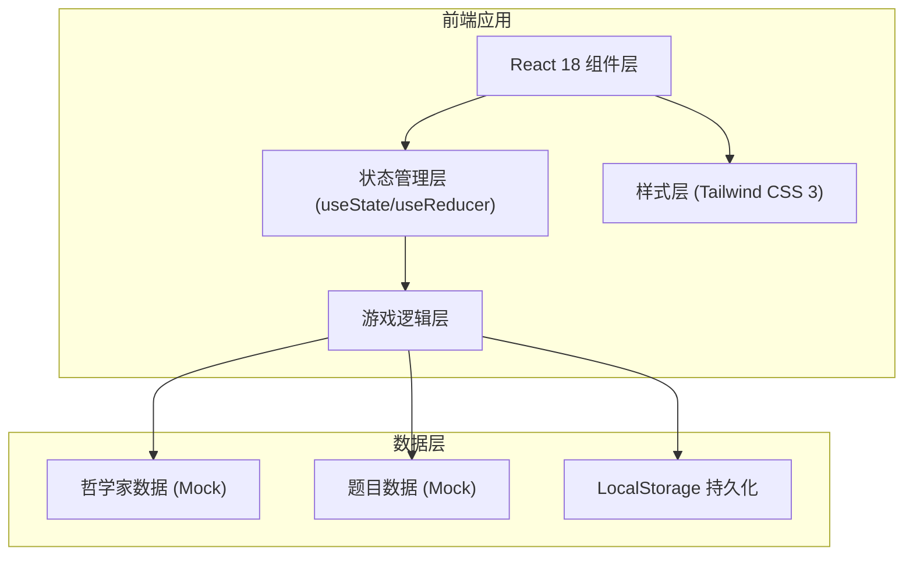

## 1. 架构设计



## 2. 技术描述

- **前端框架**：React 18 + TypeScript + Vite
- **样式方案**：Tailwind CSS 3 + CSS 变量主题系统
- **初始化工具**：npm create vite@latest
- **状态管理**：React Hooks (useState, useEffect, useReducer)
- **数据存储**：LocalStorage 存储好感度进度
- **动画方案**：CSS Keyframes + React Transition Group
- **字体方案**：Google Fonts (Ma Shan Zheng, Noto Serif SC)

## 3. 目录结构

```
src/
├── components/
│   ├── Tavern/              # 酒馆主界面
│   │   ├── TavernBackground.tsx
│   │   ├── PhilosopherCard.tsx
│   │   └── AffectionBar.tsx
│   ├── Duel/                # 对决界面
│   │   ├── SceneCard.tsx
│   │   ├── OptionCard.tsx
│   │   └── FeedbackModal.tsx
│   └── shared/              # 共享组件
│       ├── ParchmentCard.tsx
│       └── TypewriterText.tsx
├── data/
│   ├── philosophers.ts      # 哲学家数据
│   └── questions.ts         # 题目数据
├── hooks/
│   ├── useGameState.ts      # 游戏状态管理
│   └── useAffection.ts      # 好感度管理
├── types/
│   └── index.ts             # 类型定义
├── utils/
│   └── animations.ts        # 动画工具函数
├── App.tsx
├── main.tsx
└── index.css
```

## 4. 路由定义

| 路由 | 页面 | 用途 |
|------|------|------|
| / | 酒馆主界面 | 展示三位哲学家，选择对决对象 |
| /duel/:philosopherId | 对决界面 | 进行质问对决游戏 |

## 5. 核心数据模型

### 5.1 类型定义

```typescript
interface Philosopher {
  id: 'socrates' | 'nietzsche' | 'beauvoir';
  name: string;
  coreIdea: string;
  avatar: string;
  color: string;
  description: string;
  taunts: string[];      // 嘲讽语料库
  praises: string[];     // 赞赏语料库
}

interface Question {
  id: string;
  philosopherId: string;
  scene: string;         // 日常场景描述
  options: Option[];
}

interface Option {
  id: string;
  text: string;
  isCorrect: boolean;
  philosopherId: string; // 属于哪位哲学家的风格
}

interface GameState {
  currentPhilosopher: Philosopher | null;
  currentQuestion: Question | null;
  affection: Record<string, number>; // 各哲学家好感度
  score: number;
  round: number;
}
```

### 5.2 好感度系统

- 初始好感度：50
- 答对：+10
- 答错：-5
- 好感度等级：
  - 0-30: 敌对 😠
  - 31-60: 中立 😐
  - 61-80: 友好 🙂
  - 81-100: 挚友 ❤️

## 6. 核心游戏流程实现

1. **进入酒馆**：加载三位哲学家信息，从LocalStorage恢复好感度
2. **选择哲学家**：点击头像，路由跳转至/duel/:id
3. **加载题目**：随机抽取对应哲学家的题目
4. **展示场景**：卷轴展开动画，打字机效果显示场景描述
5. **玩家选择**：点击选项卡片，触发判断逻辑
6. **结果反馈**：
   - 正确：好感度+10，显示赞赏语，绿色光效
   - 错误：好感度-5，显示嘲讽语，红色光效
7. **继续/返回**：选择继续下一题或返回酒馆

## 7. 性能与体验优化

- 图片资源：使用WebP格式，预加载哲学家头像
- 动画：使用CSS transform和opacity，避免重排重绘
- 状态：使用useMemo/useCallback优化重渲染
- 数据：题目数据分片加载，避免首屏阻塞
